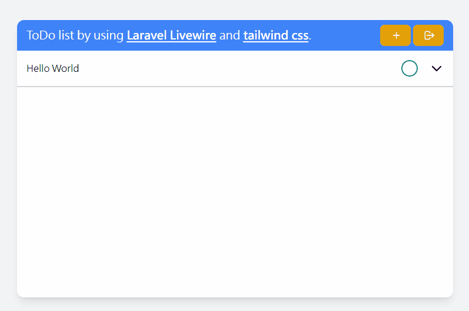

# A ToDo list webpage by using Laravel, Laravel Livewire and tailwind CSS

This is a sample ToDo list webpage by using Laravel, Laravel Livewire and tailwind css.

## Tech
- [Laravel](https://github.com/laravel/laravel): A PHP web application framework
- [Laravel Livewire](https://laravel-livewire.com): A full-stack framework for Laravel that allow developer using PHP for front-end development
- [tailwind css](https://tailwindcss.com): A utility-first CSS framework packed with classes
